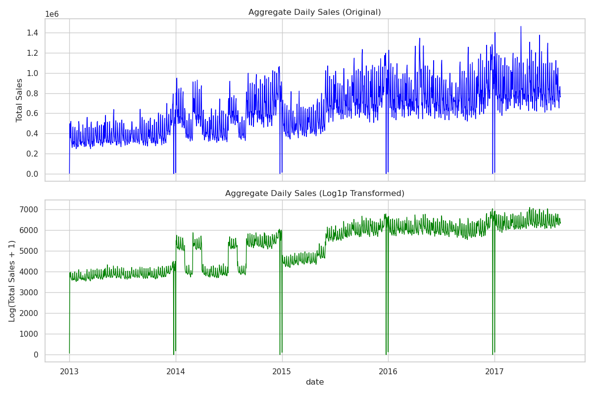
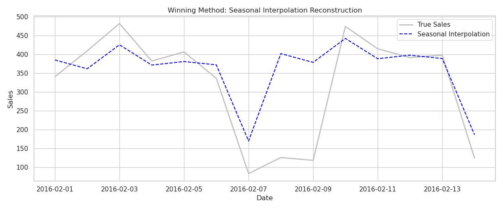
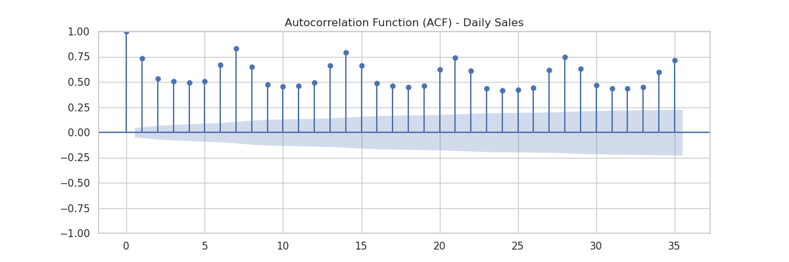
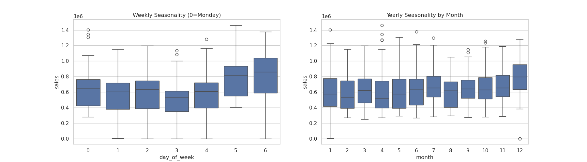
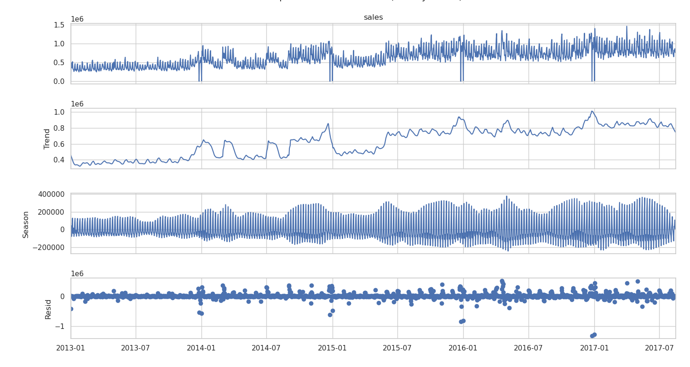
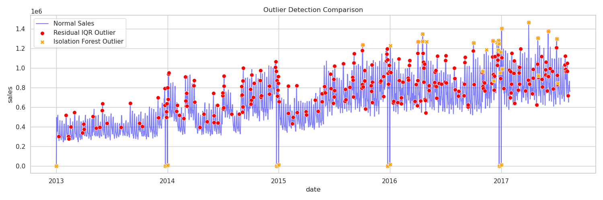
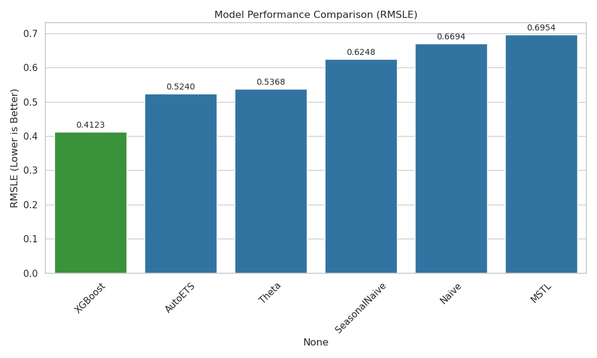
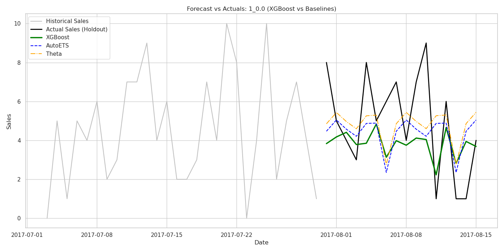
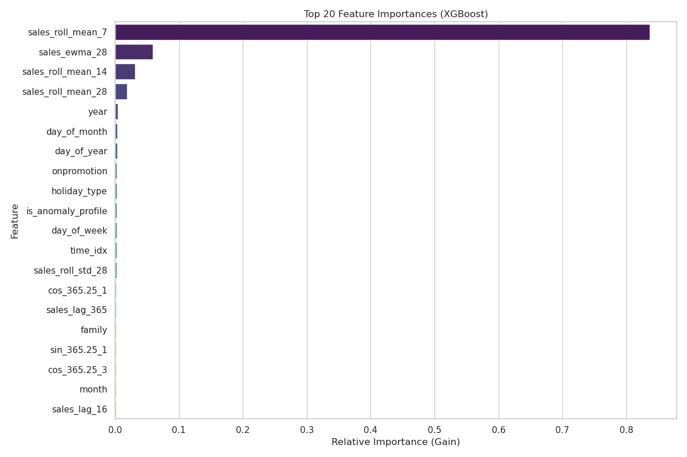

# Production-Grade Store Sales Forecasting Pipeline

  

A robust, end-to-end sales forecasting pipeline designed to predict store-level daily product demand. This project implements panel-aware feature engineering, target variance stabilization, an automated data imputation suite, and a gradient-boosted decision tree framework benchmarked against state-of-the-art statistical models.

  

## Dataset & Source

  

This project utilizes the dataset from the **Kaggle Store Sales - Time Series Forecasting** competition.

* **Source:** [Kaggle Competition Overview](https://www.kaggle.com/competitions/store-sales-time-series-forecasting/overview)

* **Context:** The dataset tracks daily sales across 1,700+ parallel time series (combinations of product families and grocery stores) for Corporación Favorita, a major retail chain in Ecuador. It includes exogenous streams: promotional flags, local/national holiday schedules, and daily crude oil prices (a proxy for Ecuador's macroeconomic health).

  

---

  

## Technical Architecture & Core Workflow

  

The repository is structured as a modular pipeline to ensure clean execution, reproducibility, and deployment readiness.

  

```

├── data/

│ ├── raw/ # Original Kaggle CSV files (train, test, stores, oil, etc.)

│ └── processed/ # Optimized panel Parquet files

├── graphs/ # Saved diagnostic, seasonality, and evaluation plots

├── notebooks/ # Exploratory Data Analysis (EDA) and rapid prototyping

├── data_processing.py # Ingestion, cleaning, and seasonal macro-imputation

├── feature_engineering.py # Generation of temporal embeddings and lag-delay spaces

├── train_and_evaluate.py # Expanding-window date TSCV and XGBoost training

├── baseline_models.py # Statistical forecasting benchmarks (statsforecast)

└── visualizations.py # Automated script to reproduce diagnostic visuals

```

  

### Execution Workflow

  

```bash

# 1. Clean raw data and impute macroeconomic gaps

python data_processing.py

  

# 2. Build panel-aware lag, rolling, and seasonal features

python feature_engineering.py

  

# 3. Train final model using strict date-based Time-Series Cross-Validation

python train_and_evaluate.py

  

# 4. Generate statistical baselines for benchmark comparisons

python baseline_models.py

  

# 5. Output diagnostic and evaluation plots to graphs/

python visualizations.py

```

## Data-Driven Modeling Decisions (EDA to Architecture)

Every architectural decision and feature design choice in this repository was explicitly driven by visual and statistical diagnostics during the research phase.

### 1. Target Variance Stabilization



- **Diagnostic (Aggregate Daily Sales Plot):** The raw sales data exhibited severe right-skewness, and the variance scaled proportionally with sales volume (heteroscedasticity).
    
- **Engineering Solution:** To stabilize the variance across thousands of individual cross-sections without losing true zero-sales days, a log-plus-one transformation was applied:
    
    $$y_t' = \log(y_t + 1)$$
    
    Minimizing the standard Mean Squared Error (MSE) on this transformed target directly optimizes the model for the competition evaluation metric (**RMSLE**).
    

### 2. Robust Macroeconomic Imputation

- **Diagnostic (Imputation Experiment):** Crude oil prices contained systemic data gaps on weekends and holidays. Testing imputation strategies via Mean Absolute Error (MAE) yielded the following results:
    
    - _Naive (Previous Week):_ MAE = 79.54 (failed during localized anomalies)
        
    - _Day Profile:_ MAE = 72.30 (captured weekly cycles but missed macro-trends)
        
    - _Seasonal Interpolation:_ **MAE = 69.89 (Winner)**
        
- **Engineering Solution:** Implemented **Seasonal Interpolation** in `data_processing.py`. By decoupling weekly seasonality from the underlying trend and interpolating the residuals, the pipeline reconstructs missing economic indicators without introducing artificial volatility.


    

### 3. Non-Stationarity & Feature-Driven Detrending

- **Diagnostic (ACF Plot & ADF Test):** The Autocorrelation Function (ACF) showed significant positive spikes at weekly intervals ($7, 14, 21, 28, 35$) with a very slow decay, indicating non-stationarity. The Augmented Dickey-Fuller (ADF) test confirmed a unit root on both raw ($p = 0.1048$) and transformed ($p = 0.2294$) aggregate sales.


    
- **Engineering Solution:** Traditional differencing presents severe error-compounding risks during inverse transformations across a multi-step panel horizon. Instead, deterministic trend indices and seasonal embeddings were injected directly into the feature space to let the tree-based model capture non-linear trends dynamically.
    

### 4. Cyclical and Structural Seasonality

- **Diagnostic (Weekly/Yearly Boxplots & STL Decomposition):** Sales consistently bottomed out on Thursdays and peaked sharply on weekends. At a macro level, sales remained flat from January to November but experienced an massive structural surge in December, alongside recurring zero-sales drops on January 1st (structural store closures).


    
- **Engineering Solution:** Standard day-of-week integer encoding treats time as discrete steps. To map continuous, overlapping cycles smoothly, `feature_engineering.py` injects continuous linear trends and annual **Fourier Terms** calculated as:
    
    $$X_{t,k} = \sin\left(\frac{2\pi k t}{365.25}\right) + \cos\left(\frac{2\pi k t}{365.25}\right)$$
    
    An STL decomposition configured with a 7-day period cleanly isolated the weekly cycle, leaving annual holiday shocks in the residuals.



### 5. Multivariate Anomaly Tagging



- **Diagnostic (Outlier Detection Plot):** Standard Residual IQR methods over-flagged the entire December shopping season as anomalous because it deviated from the base weekly cycle.
    
- **Engineering Solution:** Implemented an **Isolation Forest** operating multivariately on sales, oil prices, and promotions. It conservatively flagged only genuine anomalies (e.g., January 1st structural zeroes and extreme supply disruptions). These were engineered into a binary feature (`is_anomaly_profile`) rather than removed, enabling the model to learn conditional resilience.
    

## Feature Engineering & Leakage Guardrails

To formulate the panel dataset for supervised machine learning, time-series data was mapped into space-delay embeddings.

### 1. Time-Delay Embeddings

- **Lags:** Captured specific historical checkpoints ($t-16$, $t-23$ to capture the identical day of the previous week, and $t-365$ for annual alignment).
    
- **Rolling Aggregations:** Calculated moving means and standard deviations across 7-day, 14-day, and 28-day windows.
    
- **Exponentially Weighted Moving Averages (EWMA):** Captured recent trend momentum while exponentially decaying older history:
    
    $$EWMA_t = \alpha x_t + (1-\alpha) EWMA_{t-1}$$
    

### 2. Crucial Leakage Guardrail

Because the forecasting horizon ($H$) is fixed at **16 days**, any historical feature generated using data from days $t-1$ through $t-15$ would induce catastrophic data leakage during inference. **Every historical, rolling, and EWMA feature in this pipeline is strictly built using a minimum shift of 16 days (`.shift(16)`).**

## Validation Strategy

Standard $k$-fold cross-validation shuffles rows randomly, which destroys temporal dependency and leaks future data into past predictions. Furthermore, scikit-learn's standard `TimeSeriesSplit` splits by row indices, which fractures panel data cross-sections across different stores.

This pipeline enforces an **Expanding Window Time-Series Cross-Validation Split by Unique Date Range**. The training window expands sequentially, and the validation set is consistently locked to a 16-day forward horizon across all parallel store-family streams simultaneously, perfectly mimicking the operational constraints of production deployment.

## Model Evaluation & Benchmarking

The final optimized XGBoost regressor was benchmarked against classical statistical models implemented via the `statsforecast` library. Models were evaluated using **RMSLE** on a local 16-day holdout set.

### Performance Leaderboard



|**Model**|**Evaluation Strategy**|**RMSLE**|**Analytical Behavior / Diagnostic Notes**|
|---|---|---|---|
|**XGBoost**|Machine Learning (Panel)|**0.4123**|**Winner.** Sequentially minimizes residuals; naturally handles categorical feature interactions and non-linear rolling window intersections.|
|**AutoETS**|Statistical Smoothing|0.5240|Effective baseline. Draws a smoothed, conservative path through noise ($3.0 \le \hat{y} \le 5.5$), preventing severe over-forecasting penalties.|
|**Theta**|Statistical Decomposition|0.5368|Robust baseline performance; models long-term trend lines reliably while dampening high-frequency noise.|
|**SeasonalNaive**|Simple Baseline|0.6248|Poor. Replicates the exact value from $t-7$. Wildly over-forecasted variance by carrying random noise and anomalies forward into the horizon.|
|**Naive**|Simple Baseline|0.6694|Fails completely. Flatlines by carrying the last known scalar forward, ignoring the massive weekly purchasing cycle.|
|**MSTL**|LOESS Decomposition|0.6954|Worst. Struggles heavily with intermittent panel data and zero-counts, generating highly inaccurate decomposition artifacts.|



### Feature Importance Insights

An evaluation of XGBoost feature gains reveals a highly concentrated predictive reliance:



- Short-Term Dominance: The 7-day rolling mean (shifted by the 16-day horizon guardrail) single-handedly accounts for over 84% of the predictive gain, proving that local demand volume is the strongest anchor for future demand.
- Implicit Feature Resolution: Explicit nominal descriptors like family, month, and day_of_week showed minimal independent feature gain. This demonstrates that tree splits on historical rolling aggregates implicitly capture seasonal magnitude and categorical variance, making explicit indicators secondary to historical trend momentum.